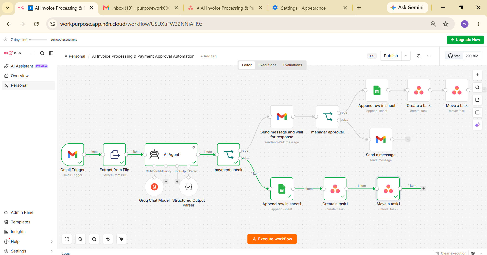
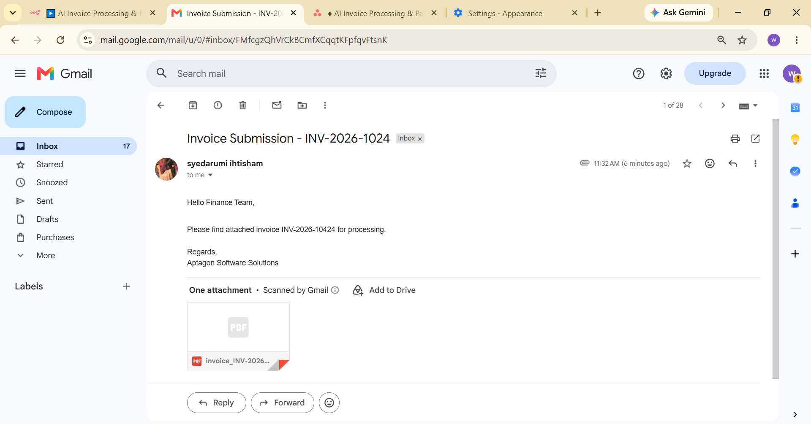
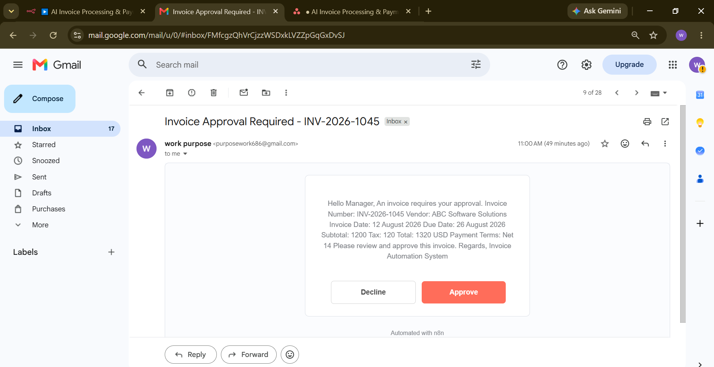
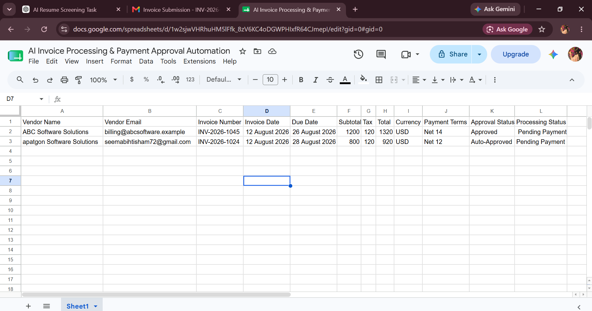
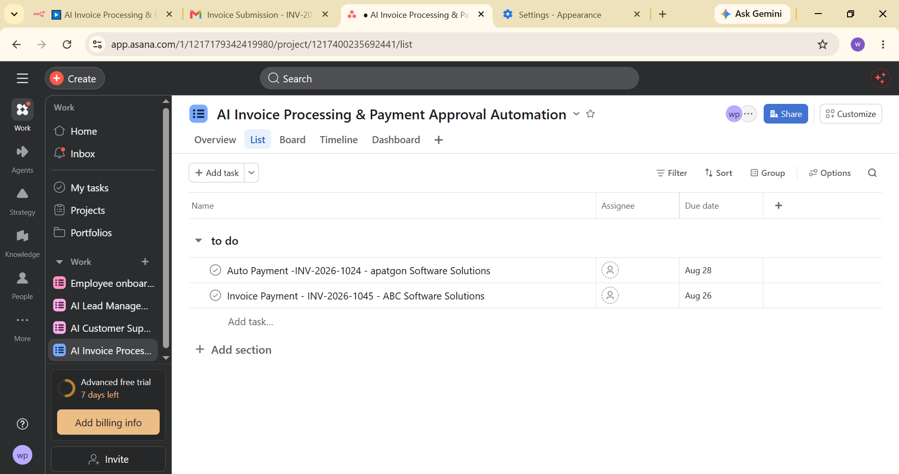
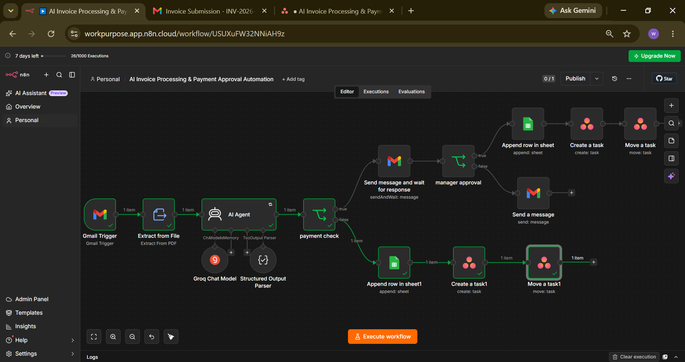

# 🤖 AI Invoice Processing & Payment Automation

An AI-powered invoice processing and payment approval automation workflow built with **n8n**.

The workflow automatically receives invoice emails through Gmail, extracts structured information from PDF invoices using AI, evaluates invoice amounts, routes high-value invoices for manager approval, records invoice data in Google Sheets, and creates finance tasks in Asana.

---

## 🚀 Overview

Manual invoice processing can require employees to:

- Read invoice emails
- Extract information from PDF documents
- Check invoice amounts
- Request manager approval
- Track approval status
- Update spreadsheets
- Create finance tasks

This automation handles these steps through a single n8n workflow.

### Workflow Flow

```text
Gmail Invoice Email
        ↓
PDF Invoice
        ↓
Extract Invoice Text
        ↓
AI Invoice Data Extraction
        ↓
Check Invoice Total
        ↓
 ┌───────────────┐
 │ Total > $1000 │
 └───────┬───────┘
         ↓
   Manager Approval
      ↙       ↘
 Approved     Rejected
    ↓            ↓
Google Sheets  Gmail Rejection
    ↓            ↓
  Asana       Google Sheets
                 

Total ≤ $1000
        ↓
Automatic Processing
        ↓
Google Sheets
        ↓
Asana Finance Task
```

---

## ✨ Key Features

### 📩 Automated Invoice Reception

The workflow uses Gmail to receive incoming invoice emails and process their PDF attachments.

### 📄 PDF Invoice Processing

The PDF attachment is converted into readable text using the **Extract From File** functionality.

### 🤖 AI Invoice Parsing

An AI Agent analyzes the extracted invoice text and converts it into structured invoice information.

The workflow extracts:

- Vendor Name
- Vendor Email
- Invoice Number
- Invoice Date
- Due Date
- Invoice Items
- Quantity
- Unit Price
- Subtotal
- Tax
- Total
- Currency
- Payment Terms

The invoice information is extracted dynamically from the actual invoice received by the workflow.

### 💰 Intelligent Approval Routing

The workflow checks the invoice total to determine whether manager approval is required.

```text
Invoice Total > $1000
        ↓
Manager Approval Required
```

Invoices of **$1000 or less** continue through the automatic processing path.

### 👤 Human Approval

High-value invoices are sent to a manager using Gmail's **Send and Wait for Response** functionality.

The workflow waits for the manager's decision before continuing.

### ✅ Approved Invoice Processing

When a manager approves an invoice:

- Invoice information is recorded in Google Sheets
- Approval status is recorded as Approved
- An Asana finance task is created

### ❌ Rejected Invoice Handling

When a manager rejects an invoice:

- A rejection email is sent to the vendor
- The invoice is recorded in Google Sheets
- Approval status is recorded as Rejected
- Processing status is recorded as Rejected

### ⚡ Automatic Processing

Invoices of $1000 or less bypass manual approval.

They are:

- Recorded in Google Sheets
- Marked as Auto-Approved
- Added to Asana for finance processing

### 📊 Google Sheets Tracking

The workflow maintains an invoice tracker containing:

- Vendor Name
- Vendor Email
- Invoice Number
- Invoice Date
- Due Date
- Subtotal
- Tax
- Total
- Currency
- Payment Terms
- Approval Status
- Processing Status

### 📋 Asana Finance Task Creation

Approved and automatically processed invoices generate finance tasks in Asana.

Each task contains relevant invoice information such as:

- Vendor
- Invoice Number
- Invoice Date
- Due Date
- Total Amount
- Currency
- Payment Terms
- Approval Status

---

## 🧠 AI Invoice Extraction

The AI Agent converts unstructured invoice text into structured data.

Example output:

```json
{
  "vendor_name": "ABC Software Solutions",
  "vendor_email": "billing@abcsoftware.example",
  "invoice_number": "INV-2026-1045",
  "invoice_date": "12 August 2026",
  "due_date": "26 August 2026",
  "items": [
    {
      "description": "Automation Platform Subscription",
      "quantity": 1,
      "unit_price": 1200
    }
  ],
  "subtotal": 1200,
  "tax": 120,
  "total": 1320,
  "currency": "USD",
  "payment_terms": "Net 14"
}
```

> The values above are example data used for testing. In the actual workflow, invoice values are extracted dynamically from incoming PDF invoices.

---

## 🔄 Workflow Logic

### High-Value Invoice

```text
Invoice Received
      ↓
Extract PDF Text
      ↓
AI Invoice Parser
      ↓
Check Invoice Total
      ↓
Total > $1000
      ↓
Manager Approval
      ↓
Approved?
   ↙       ↘
 YES       NO
  ↓         ↓
Sheets    Rejection Email
  ↓         ↓
Asana     Sheets
```

### Low-Value Invoice

```text
Invoice Received
      ↓
Extract PDF Text
      ↓
AI Invoice Parser
      ↓
Total ≤ $1000
      ↓
Automatic Processing
      ↓
Google Sheets
      ↓
Asana Finance Task
```

---

## 🛠️ Technologies Used

- **n8n** — Workflow automation
- **Gmail** — Invoice reception and approval communication
- **AI Agent** — Invoice information extraction
- **PDF Extraction** — Document processing
- **Google Sheets** — Invoice tracking
- **Asana** — Finance task management
- **JavaScript Expressions** — Dynamic data mapping

---

## 📸 Workflow Screenshots

### 🔹 Complete Workflow



### 🔹 Invoice Email



### 🔹 Manager Approval



### 🔹 Approval Check



### 🔹 Asana Finance Task



### 🔹 Automatic Processing



---

## 📁 Repository Structure

```text
AI-Invoice-Processing-Automation/
│
├── README.md
├── workflow.json
│
└── screenshots/
    ├── workflow.png
    ├── invoice_email.png
    ├── manager_approval.png
    ├── approval_check.png
    ├── asana_task.png
    └── auto_approved_invoice.png
```

---

## ⚙️ Setup

### 1. Import the Workflow

Download and import:

```text
workflow.json
```

into your n8n instance.

### 2. Configure Gmail

Connect your Gmail account and configure the Gmail nodes used for:

- Receiving invoice emails
- Sending manager approval requests
- Sending vendor rejection emails

### 3. Configure the AI Model

Connect the required AI chat model to the AI Agent.

### 4. Configure Google Sheets

Connect your Google Sheets account and select the invoice tracking spreadsheet.

### 5. Configure Asana

Connect your Asana account and select the finance project where tasks should be created.

### 6. Test the Workflow

Send an invoice PDF through Gmail and verify that:

- The invoice email is received
- The PDF is processed
- Invoice information is extracted
- The invoice total is evaluated
- High-value invoices require approval
- Approved invoices are recorded
- Rejected invoices are handled correctly
- Low-value invoices are automatically processed
- Google Sheets is updated
- Asana finance tasks are created

---

## 🔐 Credentials & Security

No credentials, passwords, API keys, or access tokens are included in this repository.

Configure your own credentials for:

- Gmail
- AI model
- Google Sheets
- Asana

Before publishing screenshots, make sure personal email addresses, tokens, IDs, and other sensitive information are hidden.

---

## 🎯 Business Use Cases

This automation can be adapted for:

- Accounts payable automation
- Vendor invoice processing
- Finance approval workflows
- Invoice tracking
- Purchase and payment workflows
- Small business finance operations
- Enterprise invoice management
- Automated finance task creation

---

## 📈 Future Improvements

Possible enhancements include:

- Duplicate invoice detection
- Vendor verification
- Invoice validation
- OCR for scanned invoices
- Automatic invoice archiving
- Slack finance notifications
- Multiple approval levels
- Currency conversion
- Payment status tracking
- Automatic payment integration
- Advanced error handling
- Retry logic
- Invoice validation against purchase orders

---

## 💡 What This Project Demonstrates

This project demonstrates practical experience with:

- AI-powered document processing
- LLM-based structured data extraction
- PDF processing
- n8n workflow automation
- Conditional workflow routing
- Human-in-the-loop approval
- Gmail integration
- Google Sheets integration
- Asana integration
- Dynamic expressions
- Business process automation
- Automated decision making
- Exception handling

---

## 👩‍💻 Project

**AI Invoice Processing & Payment Automation**

Built using:

**n8n + AI + Gmail + Google Sheets + Asana**

This project demonstrates how AI and workflow automation can transform a manual invoice-processing process into an automated, approval-aware finance workflow.
